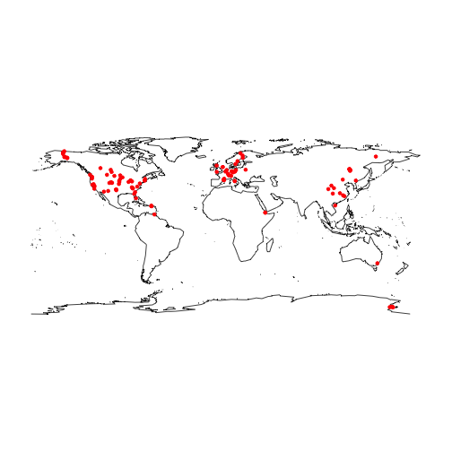
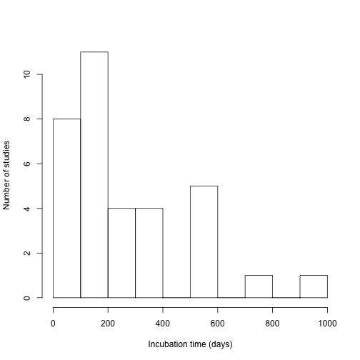
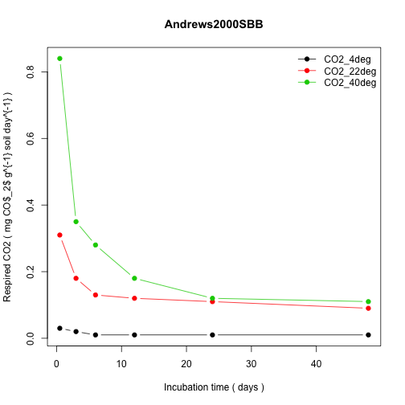

# Database summary and statistics

The number of entries in the database is 36. Most entries have multiple time-series of CO~2~ flux release from incubation experiments. The current total number of time series  is 561, and the total number of data points is 10951.


|citationKey       |doi                              |entryAuthor      |entryCreationDate |
|:-----------------|:--------------------------------|:----------------|:-----------------|
|Andrews2000SBB    |10.1016/S0038-0717(99)00206-0    |Heidi Voelkel    |2016-04-27        |
|Arevalo2012       |10.2136/sssaj2011.0126           |Heidi Voelkel    |2016-04-27        |
|Barrett2006       |10.1016/j.soilbio.2006.03.025    |Heidi Voelkel    |2016-05-09        |
|Bradford2010      |10.1111/j.1365-2486.2009.02040.x |Heidi Voelkel    |2016-07-11        |
|Chen2010          |10.1016/j.soilbio.2010.08.030    |Heidi Voelkel    |2016-07-25        |
|Conant2008a       |10.1111/j.1365-2486.2008.01541.x |Heidi Voelkel    |2016-07-26        |
|Conant2008b       |10.1890/08-0137.1                |Heidi Voelkel    |2016-07-26        |
|Craine2010NatGeo  |10.1038/NGEO1009                 |Maddie Tilyou    |2016-07-25        |
|CurielYuste2007   |10.1111/j.1365-2486.2007.01415.x |Heidi Voelkel    |2016-08-02        |
|Cusack2010GCB     |10.1111/j.1365-2486.2009.02131.x |Maddie Tilyou    |2016-06-21        |
|Dalias2001b       |10.1046/j.1365-2486.2001.00386.x |Heidi Voelkel    |2016-08-10        |
|Fang2005          |10.1038/nature03138              |Heidi Voelkel    |2016-08-19        |
|Fissore2009       |10.1111/j.1365-2486.2009.01903.x |Heidi Voelkel    |2016-08-19        |
|Gillabel2010      |10.1111/j.1365-2486.2009.02132.x |Heidi Voelkel    |2016-08-23        |
|Grisi1998         |10.1016/S0038-0717(98)00016-9    |Heidi Voelkel    |2016-08-23        |
|Haddix2011        |10.2136/sssaj2010.0118           |Heidi Voelkel    |2016-08-24        |
|Hartley2008       |10.1111/j.1461-0248.2008.01223.x |Heidi Voelkel    |2016-08-30        |
|HartleyIneson2008 |10.1016/j.soilbio.2008.01.007    |Heidi Voelkel    |2016-08-30        |
|Hopkins2006       |10.1016/j.soilbio.2006.01.012    |Heidi Voelkel    |2016-09-20        |
|JenkinsAdams2011  |10.1016/j.soilbio.2011.02.017    |Heidi Voelkel    |2016-09-22        |
|Lavoie2011JGR     |10.1029/2010JG001629             |Maddie Tilyou    |2016-10-13        |
|LeifeldFuhrer2005 |10.1007/s10533-005-2237-4        |Heidi Voelkel    |2016-09-30        |
|NeffHooper2002    |10.1046/j.1365-2486.2002.00517.x |Heidi Voelkel    |2016-10-07        |
|Niklinska1999     |10.1023/A:1006049204600          |Heidi Voelkel    |2016-10-17        |
|Reichstein2000    |10.1016/S0038-0717(00)00002-X    |Heidi Voelkel    |2016-10-27        |
|Rey2008           |10.1111/j.1365-2389.2008.01065.x |Heidi Voelkel    |2016-11-29        |
|ReyJarvis2006     |10.1111/j.1365-2486.2006.01230.x |Heidi Voelkel    |2016-10-27        |
|Sierra2017BG      |10.5194/bg-2016-474              |Carlos A. Sierra |2017-01-24        |
|Song2010          |10.1016/j.ejsobi.2010.09.003     |Heidi Voelkel    |2017-01-06        |
|Stewart2008SBB    |10.1016/j.soilbio.2008.02.014    |Maddie Tilyou    |2016-10-4         |
|Townsend1997      |10.1023/A:1017942918708          |Heidi Voelkel    |2017-01-06        |
|Wang2010          |10.1016/S1001-0742(09)60217-5    |Heidi Voelkel    |2017-01-10        |
|WicklandNeff2008  |10.1007/s10533-007-9166-3        |Heidi Voelkel    |2017-01-26        |
|Winkler1996       |10.1016/0038-0717(96)00076-4     |Heidi Voelkel    |2017-01-30        |
|Zhang2007         |10.1016/S1001-0742(07)60052-7    |Heidi Voelkel    |2017-01-31        |
|ZhuCheng2011      |10.1016/j.soilbio.2010.12.021    |Heidi Voelkel    |2017-02-07        |

## Location and ecosystem types

Locations for which data are available are presented in the following map



### Ecosystem types
A list of all ecosystem types in the database, with their number of occurrences


|                                     |  x|
|:------------------------------------|--:|
|Arable rotation                      |  1|
|Beans and Maize                      |  1|
|Boreal forest                        |  1|
|Cereals                              |  1|
|Coniferous forest                    |  1|
|Cropland                             |  2|
|Cultivated                           |  1|
|Evergreen forest                     |  1|
|Farmland                             |  1|
|Forest                               |  5|
|Forest-Tundra                        |  2|
|Glacial dry land                     |  1|
|Grassland                            |  4|
|Grassland (G)                        |  1|
|lower montane forest                 |  1|
|Maize                                |  1|
|Native forest and pasture            |  2|
|Native grassland and cultivated      |  4|
|Northern mixed-grass praire          |  1|
|Oak savanna                          |  1|
|Pasture                              |  3|
|Peatland                             |  1|
|Permanent grassland                  |  1|
|Pine, Hardwood                       |  6|
|Polar                                |  1|
|Ponderosa pine plantation            |  1|
|Scots pine monocultures              |  7|
|Sitka spruce plantation              |  1|
|Southern mixed-grass praire          |  1|
|Tundra                               |  2|
|Tundra (Tussock, Shrub)              |  1|
|Tundra (Tussock, Spruce)             |  1|
|Tundra (Tussock, Wet sedge)          |  1|
|Tundra (Tussock)                     |  1|
|wet tropical rainforest              |  1|
|Wheat cropland                       |  2|
|Winter barley cropland               |  1|
|Woodland with Grass understorey (WG) |  1|
|Woodland with Shrub understorey (WS) |  1|

### Climate
Climate types with their number of occurrences

|                      |  x|
|:---------------------|--:|
|Boreal                |  2|
|Cold                  |  3|
|Cool temperate        |  1|
|Cool-temperate        |  1|
|Mediterranean         |  1|
|Semi-arid             |  1|
|Sub-tropical          |  1|
|Temperate             | 17|
|Temperate Atlantic    |  1|
|Temperate continental |  1|
|Tropical              |  4|
|Wet Mediterranean     |  2|

### Soil Type
Soil types with their number of occurences

|                                                                |  x|
|:---------------------------------------------------------------|--:|
|Aeric Haplaquept                                                |  1|
|Alfisol                                                         |  1|
|Andisol                                                         |  1|
|Aquic Haplustoll                                                |  1|
|Aridic Paleustoll                                               |  1|
|Cambic podzol                                                   |  1|
|Cambisol                                                        |  2|
|Chernic tenosol                                                 |  1|
|Chromic cambisol                                                |  1|
|Chromic luvisol                                                 |  1|
|Coarse loamy Haplumbrepts, organic-rich (CH)                    |  1|
|Coarse- to fine loamy                                           |  1|
|Dark grey Luvisol                                               |  1|
|Dystric cambisol                                                |  3|
|Ferric podzol                                                   |  1|
|Fine loamy Haplumbrepts, organic-poor (CL)                      |  1|
|Fine-loamy Dystrochrept (HMC)                                   |  1|
|Gelic Cambisol                                                  |  1|
|Gelisol histel                                                  |  1|
|Gelisol orthel                                                  |  1|
|Gelisols                                                        |  1|
|Gleyic luvisol                                                  |  2|
|Haplocryods, Cryochrepts                                        |  1|
|Haplorthods, Fragiorthods                                       |  1|
|Hapludalfs, Quartzipsamment, Endoaquults, Paleaquults, Alaquods |  1|
|Hapludults, Dystrochrepts                                       |  1|
|Helena series, Ultisol                                          |  1|
|Humic anfisol                                                   |  1|
|Hydric Melanudand                                               |  1|
|Inceptisol cryept                                               |  1|
|Kanhapludults                                                   |  1|
|Luvisol                                                         |  2|
|Mollic Udifluvent                                               |  1|
|mor-type humus layer                                            |  7|
|NA                                                              |  5|
|organic-poor (HMC, HMH)                                         |  1|
|organic-rich (HOC, HOH)                                         |  1|
|Orthic Black Chernozem                                          |  1|
|Oxyaquic Hapludalf                                              |  1|
|Paleudult & Kandidult                                           |  1|
|Peaty gley                                                      |  2|
|Permafrost                                                      |  1|
|silt loam haplic Luvisol                                        |  1|
|Stagnic Cambisol                                                |  1|
|Stagnic Gleysol                                                 |  1|
|Tyipc Hapludalf                                                 |  1|
|Typic Argiboroll                                                |  1|
|Typic Argiudoll                                                 |  1|
|Typic Paleustoll                                                |  1|
|Typical Fluvaquent                                              |  1|
|Typical Haplaquept                                              |  1|
|Typical Hapludult                                               |  1|
|Udic Boroll                                                     |  1|
|Udipsamment                                                     |  1|
|Ultisol                                                         |  2|
|Ulttisol                                                        |  1|

### Incubation time
The database contains studies with a wide range of incubation times from 1 to 924 days.
A histogram of the incubation time for all entries is presented in Figure



## Datasets
The file `~/scripts/plotEntry.R` can be used to plot individual entries from the database. For example


```r
source("~/sidb/scripts/plotEntry.R")
plotEntry(entry=Andrews2000SBB)
```




